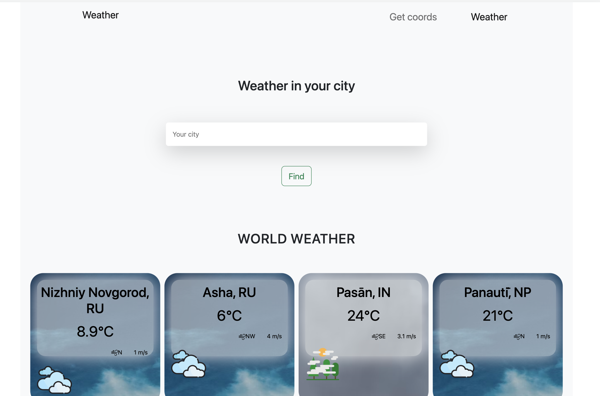
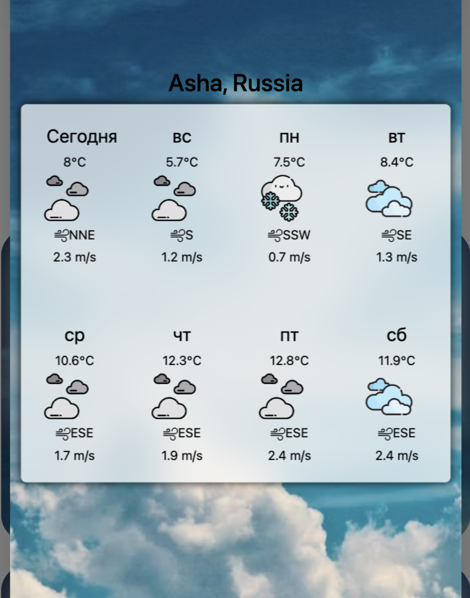

# Weather and coordinates app
Проект выпослнен для второго этапа стажировки. Приложение сделано на React.
В приложении две страницы: первая для просмотра погоды в конкретном городе (фоновое изображение, иконки меняются в зависимости от погоды), дополнительно на странице показана погода в нескольких случайных городах. Вторая страница содержит форму для получение координат любого гоорода, дополнительно реализован слайдер с изображениями погоды.

[GithubPages](https://antonovkae.github.io/weatherAndCoords/)

Проект довольно-таки простой, но основная сложность была в том, что не было опыта использования ReduxToolKit и Axios.

Использованы:
- Стек React;
- Функциональные компоненты, React-hooks;
- Модульные стили CSS с использованием стилей bootstrap;
- Роутинг React-router-dom v6.3.0;
- Redux/ReduxToolKit. Асихронность реализована благодаря созданию store с помощью configureStore;
- Работа с API с помощью клиента Axios.

Использованы открытые api:

- https://api.weatherbit.io (получение прогноза в конкретном городе с помощью широты и долготы, прогноз погоды в случайных городах по id города)
- https://api.geocodify.com (получение координат по названию города)

## Доступные команды

Для запуска приложения 

### `npm start`

Приложение запустится в режиме разработке
Открыть [http://localhost:3000](http://localhost:3000)

Для сборки приложения 

### `npm run build`

Приложение будет собрано в папке `build`

